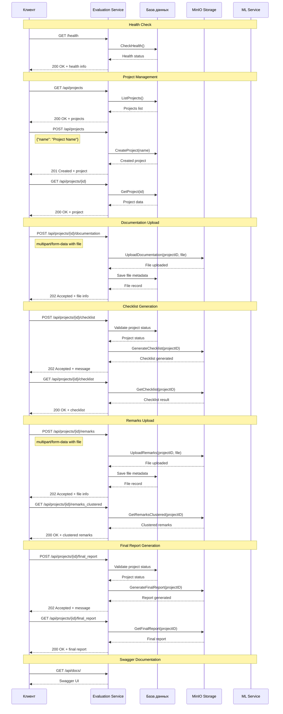

# API Sequence Diagram - Evaluation Service

Диаграмма последовательностей для всех API endpoints сервиса evaluation.

## Диаграмма

## Описание API Endpoints

### 1. Health Check
- **GET** `/health` - Проверка состояния сервиса и подключения к БД

### 2. Project Management
- **GET** `/api/projects` - Получение списка всех проектов
- **POST** `/api/projects` - Создание нового проекта
- **GET** `/api/projects/{id}` - Получение проекта по ID

### 3. Documentation Upload
- **POST** `/api/projects/{id}/documentation` - Загрузка документации проекта (max 50MB)

### 4. Checklist Operations
- **POST** `/api/projects/{id}/checklist` - Запуск генерации чеклиста
- **GET** `/api/projects/{id}/checklist` - Получение результата чеклиста

### 5. Remarks Operations
- **POST** `/api/projects/{id}/remarks` - Загрузка файла замечаний (max 50MB)
- **GET** `/api/projects/{id}/remarks_clustered` - Получение кластеризованных замечаний

### 6. Final Report Operations
- **POST** `/api/projects/{id}/final_report` - Запуск генерации финального отчета
- **GET** `/api/projects/{id}/final_report` - Получение финального отчета

### 7. API Documentation
- **GET** `/api/docs/` - Swagger UI для API документации

## Компоненты системы

- **Client** - Клиентское приложение
- **Evaluation Service** - Основной сервис (объединяет все слои)
- **DB** - PostgreSQL база данных
- **Storage** - MinIO хранилище файлов
- **ML** - ML сервис для обработки данных

## HTTP Status Codes

- **200** - Успешный GET запрос
- **201** - Успешное создание ресурса
- **202** - Запрос принят в обработку
- **400** - Ошибка в запросе
- **404** - Ресурс не найден
- **409** - Конфликт (например, проект уже обрабатывается)
- **500** - Внутренняя ошибка сервера
